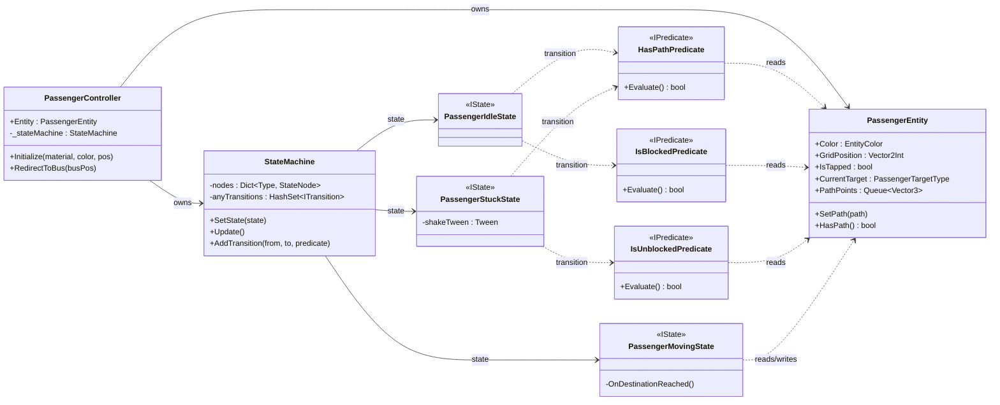

#  Bus Jam

A mobile puzzle game built as a technical case study, replicating the core mechanics of Rollic Games' *Bus Jam*.

## Gameplay

<div align="center">

[](https://drive.google.com/file/d/1MU_xMo4q0vvA7sfVYtXXZ24bEqDCa36z/view?usp=sharing)

</div>

---

**Level Editor**


---

##  Tech Stack

| | |
|---|---|
| **Engine** | Unity 2022.3.19f1 |
| **Language** | C# |
| **Async** | UniTask |
| **Tweening** | DOTween |
| **Version Control** | Git + Git LFS |

---

## Architecture

The project uses a **signal-driven, decoupled architecture**. Systems never reference each other directly — all communication goes through typed signal classes.

### Key Design Decisions

### No Singleton on Managers
Managers are plain `MonoBehaviour`s wired through signals. No hidden global state, no tight coupling. Adding or removing a manager from the scene never breaks anything else.

### ScriptableObject-based Level Data
Each level is a `LevelDataSO` asset. No prefabs, no scene dependencies. Levels are pure data, created and edited entirely through the custom editor tool.

### Custom Level Editor
`MapCreator` is a UI Toolkit `EditorWindow` for painting grid layouts, placing passengers, and configuring the bus queue — all saved directly to a `LevelDataSO` asset.

### Seamless Level Transitions
The gameplay scene loads additively in the background while the UI stays active. No loading screen between levels.

---

**Signal-based communication** — Each domain has its own signal class. Managers subscribe and emit without knowing who's listening. Systems stay independent by design.

**MonoSingleton only for Signals** — `MonoSingleton<T>` is used exclusively on signal classes as globally accessible event hubs. No logic lives in them.

**Per-entity State Machine** — Each `PassengerController` owns a `StateMachine` with `Idle`, `Moving`, and `Stuck` states. Transitions are driven by `IPredicate` conditions. Behavior is self-contained in the entity.

**A\* Pathfinding** — `GridSystem` runs A\* to find a passenger's path to the exit row. Each `GridNode` tracks G/H/F costs. Obstructed and occupied cells are skipped automatically.

---

## Architecture Diagrams

### 1 — System Architecture

```mermaid
classDiagram
    direction TB

    class MonoSingleton~T~ {
        <<abstract>>
        +Instance : T$
        +IsAvailable : bool$
    }

    %% Signals (event hubs only — no logic)
    class CoreGameSignals { <<MonoSingleton>> }
    class BusSignals { <<MonoSingleton>> }
    class GridSignals { <<MonoSingleton>> }
    class InputSignals { <<MonoSingleton>> }
    class LineSignals { <<MonoSingleton>> }
    class PassengerSignals { <<MonoSingleton>> }
    class ActiveLevelSignals { <<MonoSingleton>> }
    class SaveSignals { <<MonoSingleton>> }
    class UISignals { <<MonoSingleton>> }
    class CoreUISignals { <<MonoSingleton>> }
    class CameraSignals { <<MonoSingleton>> }

    MonoSingleton~T~ <|-- CoreGameSignals
    MonoSingleton~T~ <|-- BusSignals
    MonoSingleton~T~ <|-- GridSignals
    MonoSingleton~T~ <|-- InputSignals
    MonoSingleton~T~ <|-- LineSignals
    MonoSingleton~T~ <|-- PassengerSignals
    MonoSingleton~T~ <|-- ActiveLevelSignals
    MonoSingleton~T~ <|-- SaveSignals
    MonoSingleton~T~ <|-- UISignals
    MonoSingleton~T~ <|-- CoreUISignals
    MonoSingleton~T~ <|-- CameraSignals

    %% Managers
    class LevelManager { +currentLevelData : LevelDataSO }
    class GridManager { -_logicGrid : GridSystem }
    class BusManager { -_busQueue : Queue~BusController~ }
    class LineManager { -_lineSlots : List~LineSlot~ }
    class PassengerManager { -_registry : Dict~Vector2Int,PassengerController~ }
    class SelectionManager
    class InputManager { -isAvailableForTouch : bool }
    class CameraManager { -_virtualCamera : CinemachineVirtualCamera }
    class TimerManager { -countdown : int }
    class UIManager
    class DataManager
    class EnvPropManager

    %% Data
    class LevelDataSO {
        <<ScriptableObject>>
        +Rows / Cols : int
        +BusSequence : List~BusLineSaveData~
        +GridCells : List~CellSaveData~
    }
    class GridSystem {
        +CalculatePathToExit(x,y) List~GridNode~
        +GetNode(x,y) GridNode
        +FreeNode(x,y)
    }
    class GridNode {
        +X / Y : int
        +IsWalkable : bool
        +GCost / HCost / FCost : int
    }
    class BusController {
        +BusColor : EntityColor
        +HasAvailableSlot : bool
        +GetEntrancePosition() Vector3
        +OnPassengerBoarded() bool
    }
    class LevelLoaderCommand { +ExecuteAsync(level) UniTask }

    %% Editor
    class MapCreator {
        <<EditorWindow>>
        -_cellDataMatrix : CellSaveData[,]
        -_busSequenceList : List~BusLineSaveData~
        -_isEditMode : bool
        +CreateGUI()
        -GenerateGrid(x, y)
        -RefreshBusLineUI(count)
        -OnCellClicked(x, y, label)
        -LoadLevelDataIntoUI(data)
    }
    class LevelSaveUtility {
        <<static Editor>>
        +SaveLevel(grid, buses, capacity, path, ...)
        +GetSelectedLevel(id, path) LevelDataSO
        +DeleteSelectedLevel(id, path) bool
        -GetNextLevelId(path) int
    }

    %% Relationships
    LevelManager --> LevelLoaderCommand : owns
    LevelManager ..> CoreGameSignals : sub/emit
    LevelManager ..> SaveSignals : queries
    LevelLoaderCommand ..> CoreGameSignals : emits
    LevelLoaderCommand --> LevelDataSO : loads

    GridManager --> GridSystem : owns
    GridManager ..> CoreGameSignals : sub/emit
    GridManager ..> GridSignals : subscribes
    GridManager ..> CameraSignals : emits
    GridSystem "1" *-- "*" GridNode : contains

    BusManager "1" o-- "*" BusController : queues
    BusManager ..> CoreGameSignals : subscribes
    BusManager ..> BusSignals : sub/emit

    LineManager ..> LineSignals : subscribes
    LineManager ..> BusSignals : sub/query
    LineManager ..> CoreGameSignals : sub/emit

    PassengerManager ..> PassengerSignals : subscribes
    PassengerManager ..> GridSignals : sub/emit
    PassengerManager ..> BusSignals : queries
    PassengerManager ..> LineSignals : queries

    SelectionManager ..> InputSignals : subscribes
    SelectionManager ..> GridSignals : emits
    InputManager ..> InputSignals : sub/emit
    InputManager ..> CoreGameSignals : sub/emit

    UIManager ..> CoreGameSignals : subscribes
    UIManager ..> CoreUISignals : emits
    TimerManager ..> CoreGameSignals : sub/emit
    TimerManager ..> InputSignals : subscribes
    CameraManager ..> CameraSignals : subscribes
    DataManager ..> SaveSignals : subscribes
    EnvPropManager ..> BusSignals : subscribes

    MapCreator --> LevelSaveUtility : uses
    MapCreator ..> LevelDataSO : creates
```



---

### 2 — Passenger State Machine



---

## Project Folder Structure

<details>
<summary>Click to expand</summary>

```
Assets/_Scripts/
├── Core/                         ← State machine base classes & interfaces
│   ├── StateMachine.cs
│   ├── IState.cs / ITransition.cs / IPredicate.cs
│   ├── FuncPredicate.cs
│   └── Transition.cs
├── Editor/                       ← Custom Unity Editor tooling
│   ├── MapCreator.cs
│   └── Utils/LevelSaveUtility.cs
└── Runtime/
    ├── Commands/                 ← Async command pattern
    │   └── LevelLoaderCommand.cs
    ├── Controllers/              ← Thin view controllers
    │   └── UIPanelController.cs
    ├── Data/
    │   ├── UnityObjects/         ← ScriptableObject assets
    │   │   ├── LevelDataSO.cs
    │   │   └── ColorDataSO.cs
    │   └── ValueObjects/         ← Pure data structs
    │       ├── GridNode.cs
    │       ├── CellSaveData.cs
    │       ├── BusLineSaveData.cs
    │       └── EntityColorData.cs
    ├── Enums/
    ├── Extensions/
    │   └── MonoSingleton.cs
    ├── Factories/                ← Object construction
    │   ├── BusFactory.cs
    │   ├── CellFactory.cs
    │   ├── LineFactory.cs
    │   └── ColorMapBuilder.cs
    ├── Gameplay/
    │   ├── Entities/
    │   │   ├── Busses/
    │   │   │   ├── BusController.cs
    │   │   │   └── BusManager.cs
    │   │   └── Passenger/
    │   │       ├── PassengerEntity.cs
    │   │       ├── PassengerController.cs
    │   │       ├── States/       ← Idle / Moving / Stuck
    │   │       └── Conditions/   ← HasPath / IsBlocked / IsUnblocked
    │   └── UI/
    │       ├── LevelTextUpdater.cs
    │       └── TimerTextUpdater.cs
    ├── Handlers/
    │   └── UIEventSubscriber.cs
    ├── Interfaces/
    │   └── ICommandAsync.cs
    ├── Managers/                 ← Plain MonoBehaviours, no Singleton
    │   ├── CameraManager.cs
    │   ├── DataManager.cs
    │   ├── GridManager.cs
    │   ├── InputManager.cs
    │   ├── LevelManager.cs
    │   ├── LineManager.cs
    │   ├── PassengerManager.cs
    │   ├── PersistentManager.cs
    │   ├── SelectionManager.cs
    │   ├── TimerManager.cs
    │   ├── UIManager.cs
    │   └── EnvPropManager.cs
    ├── Signals/                  ← MonoSingleton event hubs, one per domain
    │   ├── CoreGameSignals.cs
    │   ├── ActiveLevelSignals.cs
    │   ├── BusSignals.cs
    │   ├── CameraSignals.cs
    │   ├── GridSignals.cs
    │   ├── InputSignals.cs
    │   ├── LineSignals.cs
    │   ├── PassengerSignals.cs
    │   ├── SaveSignals.cs
    │   ├── UISignals.cs
    │   └── CoreUISignals.cs
    ├── Systems/
    │   └── GridSystem.cs
    └── Utils/
        ├── BusJamMathUtil.cs
        └── ConstantUtil.cs
```

</details>
